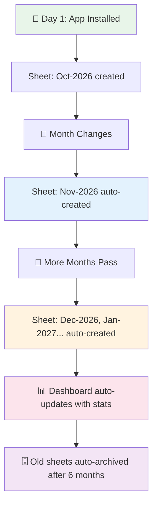

# 🚀 Missed Call Logger — Complete Setup Guide

## ✅ All Code Files Created!

Your project is ready. Here's everything that was built:

---

## 📂 Project File Structure

```
call-logs/
├── 📄 google_apps_script.js          ← Paste into Google Apps Script
│
└── 📁 android/app/
    ├── 📄 build.gradle                ← Dependencies & config
    ├── 📄 proguard-rules.pro          ← Release build rules
    │
    └── 📁 src/main/
        ├── 📄 AndroidManifest.xml     ← Permissions & components
        │
        ├── 📁 java/com/missedcalllogger/app/
        │   ├── 📄 MissedCallLoggerApp.kt   ← App initialization
        │   ├── 📄 MainActivity.kt          ← Main UI screen
        │   │
        │   ├── 📁 receiver/
        │   │   ├── 📄 CallReceiver.kt          ← Detects missed calls
        │   │   ├── 📄 BootReceiver.kt          ← Auto-start on reboot
        │   │   └── 📄 NetworkChangeReceiver.kt ← Auto-sync when online
        │   │
        │   ├── 📁 service/
        │   │   └── 📄 MissedCallService.kt     ← Foreground service
        │   │
        │   ├── 📁 network/
        │   │   └── 📄 GoogleSheetHelper.kt     ← HTTP POST to Sheets
        │   │
        │   └── 📁 util/
        │       ├── 📄 PrefsManager.kt          ← App settings storage
        │       ├── 📄 PendingCallsManager.kt   ← Offline queue
        │       └── 📄 NotificationHelper.kt    ← Notifications
        │
        └── 📁 res/
            ├── 📁 layout/
            │   └── 📄 activity_main.xml        ← Main screen UI
            ├── 📁 drawable/
            │   ├── 📄 edit_text_bg.xml         ← Input field style
            │   └── 📄 ic_notification.xml      ← Notification icon
            └── 📁 values/
                ├── 📄 strings.xml              ← App strings
                └── 📄 themes.xml               ← App theme
```

---

## 🔄 Auto-Scaling Features (What Updates Automatically)



| Feature | What Happens | When |
|---------|-------------|------|
| **📅 Monthly Sheets** | New sheet created (e.g., "Nov-2026") | First missed call of each new month |
| **🔢 Serial Numbers** | Auto-increments across all sheets (1, 2, 3...) | Every missed call |
| **📊 Dashboard** | Stats update: total, today, week, month, top callers | Every missed call |
| **📈 Monthly Breakdown** | Shows call count per month in Dashboard | Every missed call |
| **👥 Top Callers** | Ranks most frequent missed callers | Every missed call |
| **🌐 Offline Sync** | Queued calls auto-upload when internet returns | Internet restored |
| **🔄 Boot Restart** | Service auto-starts when phone reboots | Phone restart |
| **🗄️ Auto-Archive** | Sheets older than 6 months are hidden | Monthly (1st of month) |

---

## 📋 Setup Steps (Do This In Order)

### Step 1: Google Sheet Setup (5 mins)
1. Go to [Google Sheets](https://sheets.google.com) → Create new spreadsheet
2. Name it **"Missed Call Log"**
3. Go to **Extensions → Apps Script**
4. Delete default code → Paste contents of [`google_apps_script.js`](file:///c:/Users/Admin/Desktop/call-logs/google_apps_script.js)
5. Click **Run → initialSetup** (first time only, to create Dashboard)
6. Click **Deploy → New Deployment → Web App**
   - Execute as: **Me**
   - Who has access: **Anyone**
7. Click **Deploy** → **Copy the URL** (you'll need this!)

> [!TIP]
> Also run `setupAutoArchiveTrigger` once to enable monthly auto-archival of old sheets.

### Step 2: Android Studio Setup (10 mins)
1. Open **Android Studio** → **New Project** → **Empty Activity**
2. Set package name: `com.missedcalllogger.app`
3. Copy all files from [`android/`](file:///c:/Users/Admin/Desktop/call-logs/android) folder into your project
4. **Sync Gradle** → Let dependencies download

### Step 3: Install & Configure (5 mins)
1. Connect your Android phone via USB (enable **USB Debugging**)
2. Click **Run** in Android Studio
3. On the app:
   - Paste the **Google Apps Script URL** from Step 1
   - Tap **Save URL**
   - Tap **Test Connection** (should show ✅)
   - Tap **Start Monitoring**
4. Grant all permissions when prompted

### Step 4: Test It! (2 mins)
1. Call your phone from another phone
2. **Don't answer** the call
3. Check your Google Sheet → A new row should appear! 🎉

---

## 📊 What Your Google Sheet Will Look Like

### Monthly Sheet (Oct-2026):
| Sr. No | Phone Number | Caller Name | Date | Time | Call Type |
|--------|-------------|-------------|------|------|-----------|
| 1 | +91 98765 43210 | Rahul | 2026-10-05 | 11:45 AM | Missed |
| 2 | +91 87654 32109 | Unknown | 2026-10-05 | 02:30 PM | Missed |

### Dashboard (Auto-Updated):
| Metric | Value |
|--------|-------|
| Total Missed Calls (All Time) | 247 |
| Missed Calls Today | 3 |
| Missed Calls This Week | 18 |
| Missed Calls This Month | 52 |
| Active Monthly Sheets | 5 |

### Top Callers (Auto-Ranked):
| Rank | Caller | Missed Count |
|------|--------|-------------|
| 1 | +91 98765 43210 (Boss) | 23 |
| 2 | +91 87654 32109 (Mom) | 15 |

---

## 🔧 Troubleshooting

| Problem | Solution |
|---------|----------|
| Service stops after a while | Disable battery optimization for the app in Settings |
| Calls not detected on Xiaomi/MIUI | Enable "Autostart" in MIUI Security settings |
| No data in Google Sheet | Check if the Apps Script URL is correct, test connection |
| Pending sync count increasing | Check internet connection; calls will auto-sync when online |
| Missing caller name | Grant Contacts permission in app settings |

---

> [!IMPORTANT]
> **For Xiaomi/MIUI, Samsung, OnePlus, Oppo, Vivo users**: These manufacturers aggressively kill background apps. You MUST:
> 1. Add the app to "Protected Apps" / "Battery optimization exclusion"
> 2. Enable "Autostart" permission
> 3. Lock the app in Recent Apps (swipe down on the app card)
